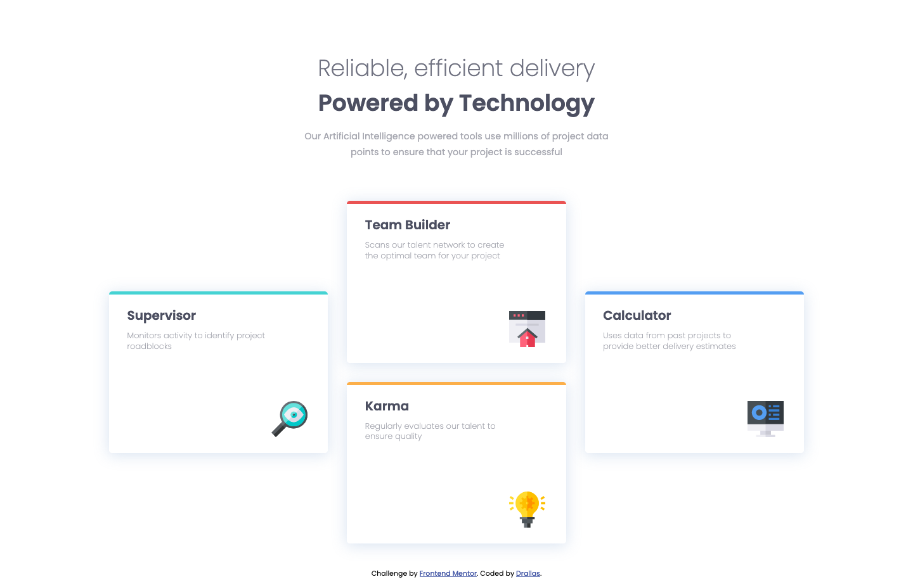

# Frontend Mentor - Four card feature section solution

This is a solution to the [Four card feature section challenge on Frontend Mentor](https://www.frontendmentor.io/challenges/four-card-feature-section-weK1eFYK). Frontend Mentor challenges help you improve your coding skills by building realistic projects. 

## Table of contents

- [Overview](#overview)
  - [The challenge](#the-challenge)
  - [Screenshot](#screenshot)
  - [Links](#links)
- [My process](#my-process)
  - [Built with](#built-with)
  - [What I learned](#what-i-learned)
  - [Continued development](#continued-development)
  - [Useful resources](#useful-resources)
- [Author](#author)
- [Acknowledgments](#acknowledgments)

## Overview

### The challenge

Users should be able to:

- View the optimal layout for the site depending on their device's screen size

### Screenshot

### Links

- Solution URL: [GitHub](https://github.com/Drallas/Four-card-feature-section)
- Live Site URL: [GitHub Pages](https://drallas.github.io/Four-card-feature-section/)

## My process

### Built with

- Semantic HTML5 markup
- CSS
- BEM
- Add more...

### What I learned

I learned to make first one component and then apply the classes to the other HTML elements. Also trying to avoid as much as possible duplication of CSS selectors. 

This was also the first (beside following tutorials) that I used the grid system, but tutorials are not triggering. 

I'm also starting to become more comfortable with the Dev Tools in Firefox. 

### Continued development

I'm still a beginner, i set up a gooed workflow but to become comfortable I simply need to build more projects. With the CSS Flexbox and Grid system i need much more hands-on before I can create everyhthing without referencing my Notion documentation or online Search.   

### Useful resources

- [Grid Layoutit](https://grid.layoutit.com) - I'm a visual learner, in the process o learning this helps me to focus on implementing the concept without having to struggle on the CSS details. A promise to myself; next one i write from scratch.
- [CSS Trick Complete Grid Guide](https://css-tricks.com/snippets/css/complete-guide-grid/) I had seen and bookmarked this one before, but now I had to read it again, to understand and extract what i needed to make the grid look as the design wanted!

## Author

- Frontend Mentor - [@Drallas](https://www.frontendmentor.io/profile/Drallas)
- Dev.to - [@Drallas](https://dev.to/drallas)

## Acknowledgments

This is where you can give a hat tip to anyone who helped you out on this project. Perhaps you worked in a team or got some inspiration from someone else's solution. This is the perfect place to give them some credit.
